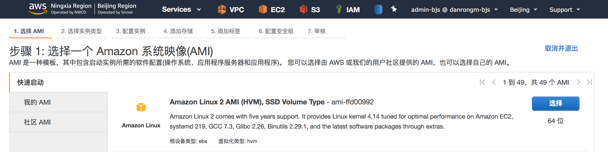
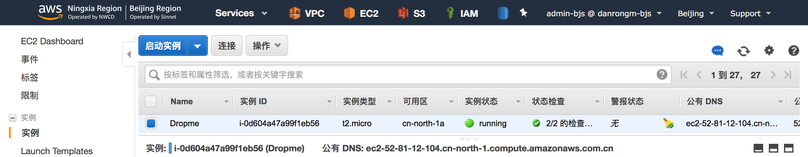
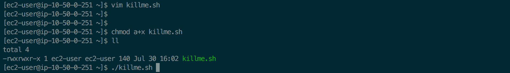
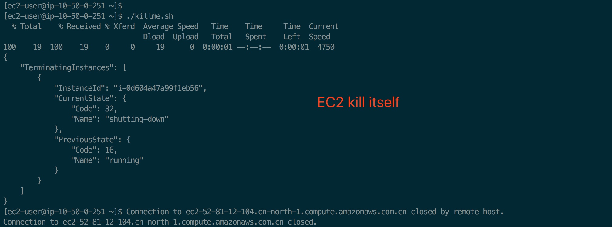
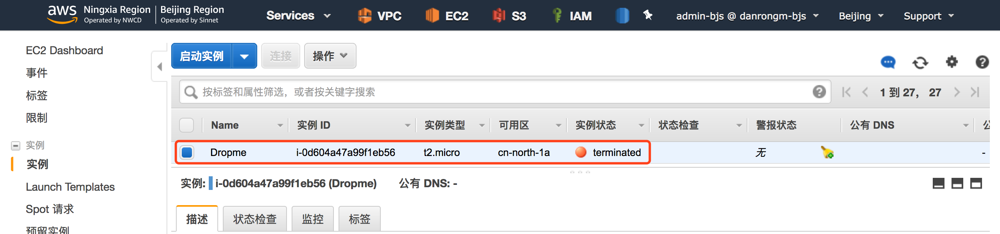

# **EC2-Terminate-Itself**  





SSH to EC2 instance

[ec2-user@ip-10-50-0-251 ~]$ vim killme.sh

```bash
#!/bin/bash

instanceID=$(curl http://169.254.169.254/latest/meta-data/instance-id)

aws ec2 terminate-instances --instance-ids $instanceID
```

```bash
[ec2-user@ip-10-50-0-251 ~]$ chmod a+x killme.sh
[ec2-user@ip-10-50-0-251 ~]$ ll
total 4
-rwxrwxr-x 1 ec2-user ec2-user 140 Jul 30 16:02 killme.sh
[ec2-user@ip-10-50-0-251 ~]$ aws configure
AWS Access Key ID [None]: XXX
AWS Secret Access Key [None]: XXX
Default region name [None]: XXX
Default output format [None]: json
```








----

(Option) Create an IAM Instance Profile that allows this  instance to execute that command. here's an example IAM policy:

```json
{
  "Version": "2012-10-17",
  "Statement": [
    {
      "Sid": "Stmt1445282779357",
      "Action": [
        "ec2:TerminateInstances"
      ],
      "Effect": "Allow",
      "Resource": "arn:aws:ec2:us-east-1:12345678910:ec2/*"
    }
  ]
}
```

Obviously you need to substitute the correct region and account number above.